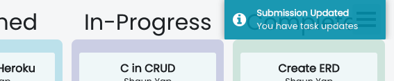

# Scrum-ptious

A workflow dashboard that maximizes your team's efficiency by allowing assignment and tracking of tasks, as well as communications between teammates via chat. 

Socket.io is hooked into the Express server so that all data is pushed to clients in real time. Users are then immediately notified of these changes.

Developed for demonstration purposes for the final project of Lighthouse Labs Web Development Bootcamp

## Tech Stack
* PostgresSql
* Express
* React.js
* Node.js
* Socket.io

This project was bootstrapped with [Create React App](https://github.com/facebook/create-react-app).

## Overview

### Dashboard

The dashboard gives an overview of a project's progress. Using React-chartjs to visualize the portion of tasks that are assigned, in progress, in review, completed and late. The manager can also see the individual progress of his team members. 

  
   

### Tasks

Tasks are organized into a kanban board with columns for 'assigned', 'in progress' and 'completed'.

  
  

Managers can create and assign tasks to his team members. Employees can see their assigned tasks updated in real time and drag them to the 'in progress' column to notify their manager that they are working on it. 

### Chat

Users can communicate with their team via a built-in chat feature

### Submissions

Employees can select a task and submit it for submission. Upon submission, managers can either accept or reject it, as well as give feedback

  
  

## License
[MIT](htps://choosealicense.com/licenses/mit/)
